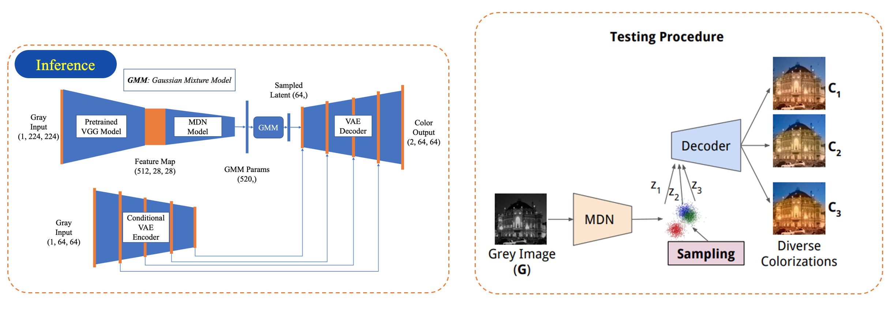

## Download Data
```
!gdown 187x5YSXYibG4QwC5m_Hx8cNzPGVTXv6G
!unzip -q data.zip
!rm data.zip
```
## Inference
```
python main.py
```
# VAE-based Image Colorization
Implementation of Learning Diverse Image Colorization in PyTorch.

## A. Paper Idea
### 1. Training
In this paper, the author employs a variant of the VAE model, called Conditional VAE (CVAE). This model consists of three components: the main Encoder block and the main Decoder block (these two blocks form a basic VAE network, enclosed by a red rectangle), along with a Conditional Encoder block (which helps the model leverage available contextual information to the fullest). The input to the basic VAE network is a color field C with dimensions (2 x h x w), and the output is a similarly sized feature map (2 x h x w). Simultaneously, the grayscale image G (1 x h x w) is also used as a starting point for the Conditional Encoder block to extract feature maps containing local information, which are then utilized as conditions to enhance the capability of the Decoder block.


### 2. Inference
The input of the Conditional Variational Autoencoder (CVAE) network requires information about both the color field C and the grayscale image G. During training, the main Encoder block maps the information of the color field C to a posterior distribution P, then samples from the distribution P to initialize the Decoder block. However, during inference, no information about the color field C is provided. Therefore, an MDN (Mixture Density Network) is designed. The MDN takes as input a feature vector generated by passing the grayscale image G through a pre-trained VGG network in the Colorful Image Colorization paper. The output result of the MDN model is then used to generate parameters for the distribution of a Gaussian Mixture Model, a model that approximates the distribution P generated from the previously trained Encoder block.




```

